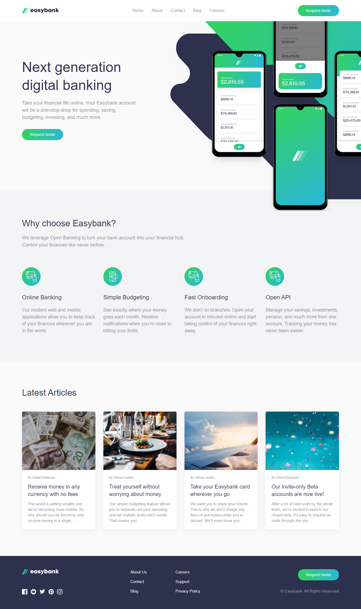
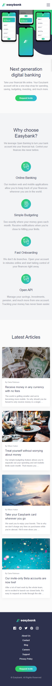
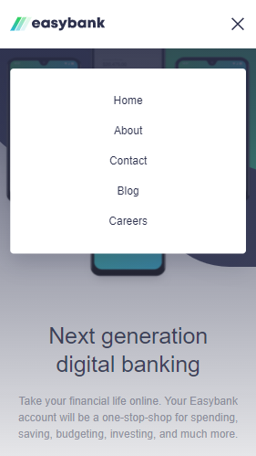

# Frontend Mentor - Easybank landing page solution

This is a solution to the [Easybank landing page challenge on Frontend Mentor](https://www.frontendmentor.io/challenges/easybank-landing-page-WaUhkoDN). Frontend Mentor challenges help you improve your coding skills by building realistic projects.

## Table of contents

-  [Overview](#overview)
   -  [The challenge](#the-challenge)
   -  [Screenshot](#screenshot)
   -  [Links](#links)
-  [Built with](#built-with)
-  [Author](#author)

## Overview

### The challenge

Users should be able to:

-  View the optimal layout for the site depending on their device's screen size
-  See hover states for all interactive elements on the page

### Screenshot

   Desktop
     
  

   Mobile
     
  
    
  

### Links

-  Solution URL: [solution URL here](https://www.frontendmentor.io/solutions/responsive-easybank-landing-page-using-flexbox-and-css-grid-3R2oAJ5p_m)
-  Live Site URL: [live site URL here](https://vigorous-lamport-a822dd.netlify.app/)

## Built with

-  Semantic HTML5 markup
-  Sass
-  Flexbox
-  CSS Grid
-  JavaScript
-  Desktop-first workflow
-  [Webpack](https://webpack.js.org/) - Module bundler

## Author

-  Facebook - [Indra Adi Kusuma](https:/facebook.com/profile.php?id=100009019826862)
-  Instagram - [@mrx.indra](https://instagram.com/mrx_indra)
-  Twitter - [@indrakusuma007](https://twitter.com/indrakusuma007?s=09)
-  LinkedIn - [Indra Adi Kusuma](https://www.linkedin.com/in/indra-adi-kusuma-a37955173)
-  Frontend Mentor - [@indraAK](https://www.frontendmentor.io/profile/indraAK)
